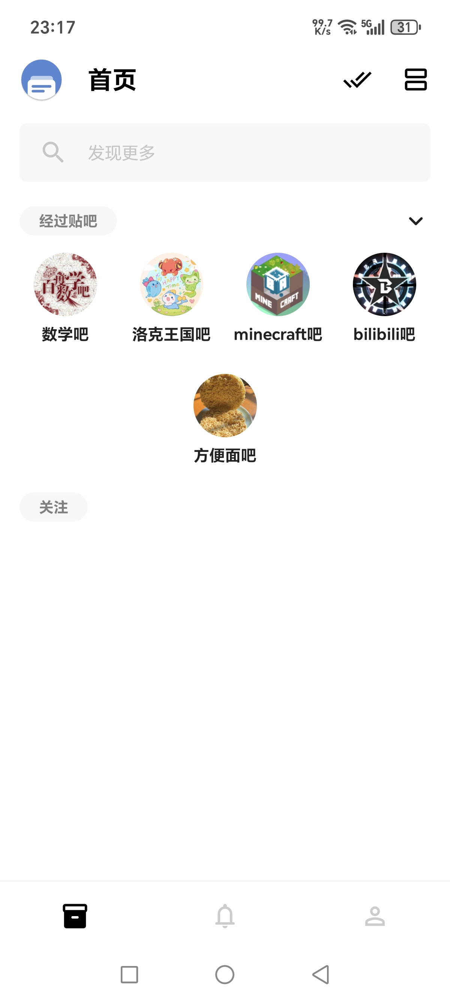
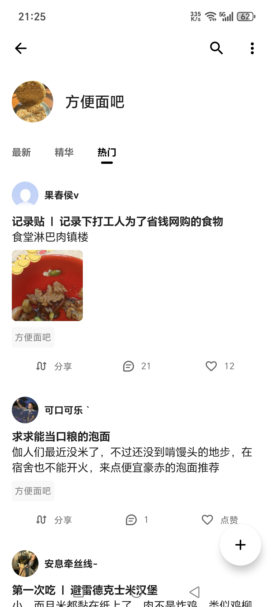

# 
Tieba Lite

    
    

贴吧 Lite 是一个**非官方**的贴吧客户端。本仓库是 [HuanCheng65/TiebaLite](https://github.com/HuanCheng65/TiebaLite) 的分支，完整保留了它的提交历史（865 个 commit），改动集中在下面这几件事。

## 和其他维护版的区别

社区里还有 [0ranko0P/TiebaLite](https://github.com/0ranko0P/TiebaLite)、[zzc10086/TiebaLite](https://github.com/zzc10086/TiebaLite) 等基于上游继续维护的分支，它们和上游一样保留了**底栏的「动态」跨吧随机推荐流**（以及精华/热门的多级分类标签）。

**本分支默认不显示「动态」栏**（`hideExplore` 默认改成 `true`，设置里可以再打开）。理由是跨吧随机推荐很容易把时间吃掉，而且它跟「想好好看某个吧」这件事是冲突的。

我们换来的东西是**吧内热门**：直接接百度贴吧小程序的免登录接口，取真正属于这个吧的热门帖，而不是全站随机。

    
    

## 新增功能

| 需求 | 实现 | 位置 |
| --- | --- | --- |
| 吧内热门 tab | 小程序 `tiebaswan.baidu.com/c/f/frs/page` 免登录接口，`tab_id=2` 取热门；参数按字典序拼串 + 固定 SECRET 做 MD5 签名。放在「精华」右边，卡片复用原 `FeedCard` | `api/swan/SwanTiebaApi.kt`、`ui/page/forum/hotthread/`、`ForumPage` |
| 免登录收藏 | 帖子卡片右下角的爱心就是本地收藏，**图标不变**，已收藏显示实心；点击有 toast 提示 | `ui/widgets/compose/FeedCard.kt` 的 `ThreadAgreeBtn` |
| 收藏存哪儿 | LitePal 新表 `Favorite`（`litepal.xml` 37→38），只落本机，不上传 | `models/database/Favorite.kt`、`repository/FavoriteRepository.kt` |
| 浏览缓冲区 | 详情页翻过的页/正文/图片地址记在**纯内存** LRU（10 分钟 TTL，上划清进程即失效）；不发额外请求、不卡 UI。收藏瞬间把快照一起落库，所以收藏里能搜正文、导出才有内容 | `utils/ThreadViewCache.kt`、`ThreadPage` 的 `LaunchedEffect` |
| 收藏页 | 关键词搜索（标题/吧名/作者/摘要/**正文**）、多选全选、长按复制链接或删除 | `ui/page/favorite/` |
| 导出 | ① 单文件 HTML：左侧全部帖子标题目录 + 站内搜索框，图片抓下来转 base64 内嵌，离线可看；② 链接+标题 txt；③ 可再导入的 json 备份 | `utils/FavoriteHtmlExporter.kt` |
| 导入 | 系统文件选择器选 json，按 threadId 去重合并 | `FavoriteRepository.importPayload` |
| 免登录看吧历史 | 首页「最近逛的吧」不再因为未登录而整块消失；推荐接口失败不再拖垮整个首页 | `HomePage.kt`、`HomeViewModel.kt` |
| 首页历史样式 | 图标放大到 52dp、图上文下、一行 4 个自动换行，逛得再多也不用左右滑 | `HomePage.kt` |

入口：「我」页的**我的收藏** —— 未登录进本地收藏页（深链 `tblite://favorite_local`），已登录进原来的服务端收藏夹。

### 关于热门接口的已知局限

- 这个接口**不返回发帖时间**（`feed_social` 里只有 tid / 评论数 / 赞数 / 分享数），所以卡片上没法显示时间
- 每次刷新热门榜都会重排，而且会出现只有一两条评论的帖子，因为它按的是吧内热度而不是回复数
- 想要「按时间或回复数排序的精华」，还是得用需要登录的 pb 接口

## 两种包

每次构建出两个包，可与官方版同时安装：

| 包 | applicationId | 应用名 |
| --- | --- | --- |
| 正式版 `official` | `com.huanchengfly.tieba.post` | 贴吧 Lite |
| 共存版 `coexist` | `com.huanchengfly.tieba.post.coexist` | 贴吧 Lite 共存 |

靠 AGP productFlavor 实现：只改 `applicationIdSuffix` 和应用名，`namespace` 不动（它决定 `BuildConfig`/`R` 的包路径）。FileProvider 和 androidx-startup 的 authority 都改成 `${applicationId}.xxx`，否则两个 App 会抢同一个 authority、manifest merger 会直接冲突。

## 自动构建

`.github/workflows/build-apk.yml` 在 push / PR / 手动触发时跑：

1. JDK 17 + runner 自带 Android SDK + Gradle 缓存
2. `./gradlew assembleRelease` —— 两个 flavor 一起出（仓库默认没有 `keystore.properties`，会自动退回 debug 签名，保证任何 fork 都能直接出包）
3. APK 收集到 `dist/` 上传成 Actions Artifact；打 `v*` tag 时额外挂到 Release，说明用 `.github/RELEASE_NOTES.md`

想让产物用你自己的正式签名，在仓库 **Settings → Secrets and variables → Actions** 里加：

| Secret | 说明 |
| --- | --- |
| `KEYSTORE_BASE64` | keystore 文件的 base64（`base64 -w0 release.keystore`） |
| `KEYSTORE_PASSWORD` | keystore 密码 |
| `KEYSTORE_ALIAS` | 密钥别名 |
| `KEYSTORE_KEY_PASSWORD` | 密钥密码 |

## 说明

**本软件及源码仅供学习交流使用，严禁用于商业用途。**

## 友情链接

+ [Starry-OvO/aiotieba: Asynchronous I/O Client for Baidu Tieba](https://github.com/Starry-OvO/aiotieba)
+ [n0099/tbclient.protobuf: 百度贴吧客户端 Protocol Buffers 定义文件合集](https://github.com/n0099/tbclient.protobuf)